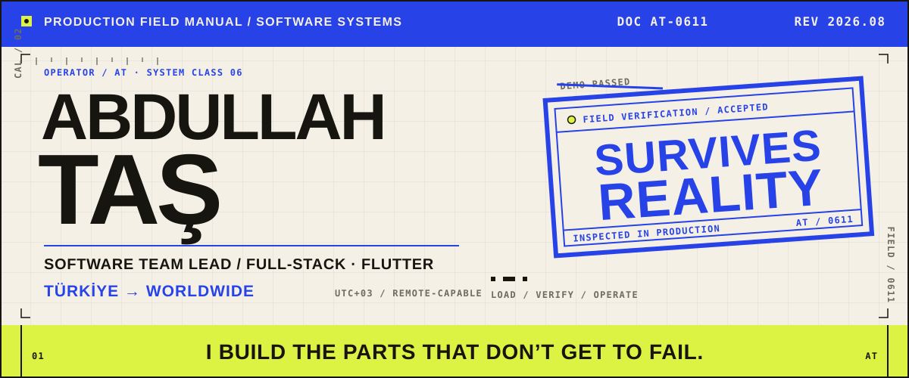
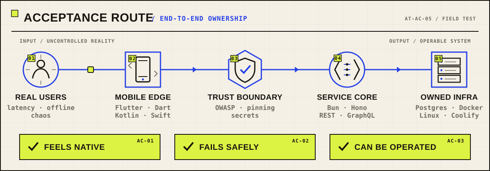
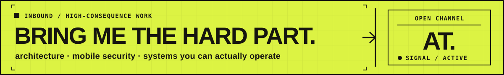

<picture>
  <source media="(max-width: 900px) and (prefers-color-scheme: dark)" srcset="./assets/hero-mobile-dark.svg">
  <source media="(max-width: 900px) and (prefers-color-scheme: light)" srcset="./assets/hero-mobile-light.svg">
  <source media="(prefers-color-scheme: dark)" srcset="./assets/hero-dark.svg">
  <source media="(prefers-color-scheme: light)" srcset="./assets/hero-light.svg">
  
</picture>

  <a href="https://abdullahtas.dev"><strong>WEBSITE</strong></a>
  &nbsp;·&nbsp;
  <a href="https://pub.dev/publishers/abdullahtas.dev/packages"><strong>PACKAGES</strong></a>
  &nbsp;·&nbsp;
  <a href="https://medium.com/@abdullahtas"><strong>FIELD NOTES</strong></a>
  &nbsp;·&nbsp;
  <a href="https://www.linkedin.com/in/abdullahtas/"><strong>LINKEDIN</strong></a>
  &nbsp;·&nbsp;
  <a href="mailto:dev.abdullahtas@gmail.com"><strong>EMAIL</strong></a>

 

## 01 / INSPECTION NOTE

### I build systems that survive contact with reality

I work where **product, architecture, and operations** meet: mobile experiences that stay smooth under load, service boundaries that keep secrets on the server, and infrastructure I can still explain at 03:00.

I lead software teams and ship end to end from Türkiye. If I put something into production, I want to understand how it **renders, fails, recovers, deploys, and gets operated** — not just how it looked in the demo.

> **My acceptance test:** feels native · fails safely · can be operated

<picture>
  <source media="(max-width: 900px) and (prefers-color-scheme: dark)" srcset="./assets/acceptance-route-mobile-dark.svg">
  <source media="(max-width: 900px) and (prefers-color-scheme: light)" srcset="./assets/acceptance-route-mobile-light.svg">
  <source media="(prefers-color-scheme: dark)" srcset="./assets/acceptance-route-dark.svg">
  <source media="(prefers-color-scheme: light)" srcset="./assets/acceptance-route-light.svg">
  
</picture>

 

## 02 / FIELD FIXES SHIPPED

These are not portfolio props. They are reusable answers to problems that showed up in real engineering work.

### 01 — [`video_pool`](https://github.com/abdullahtas0/video-pool) / motion under pressure

**Enterprise video orchestration for feeds that refuse to jank.** Intelligent controller pooling, HLS and cache coordination, and automatic device protection for TikTok- and Reels-style experiences.

`Dart` · `Flutter` · `Kotlin` · `Swift` · `video orchestration` 
[view source](https://github.com/abdullahtas0/video-pool) · [open live demo](https://abdullahtas0.github.io/video-pool/) · [package on pub.dev](https://pub.dev/packages/video_pool)

---

### 02 — [`tr_payment_hub`](https://github.com/abdullahtas0/tr_payment_hub) / one boundary, four gateways

**A single typed interface over Türkiye's payment landscape.** iyzico, PayTR, Param, and Sipay sit behind one API; proxy mode keeps merchant secrets where they belong — on the server.

`Dart` · `Flutter` · `payments` · `secure proxy` · `typed APIs` 
[view source](https://github.com/abdullahtas0/tr_payment_hub) · [package on pub.dev](https://pub.dev/packages/tr_payment_hub)

---

### 03 — [`glance_widget`](https://github.com/abdullahtas0/glance_widget) / Flutter beyond the app

**The home-screen bridge Flutter should have shipped with.** Instant-updating widgets backed by Jetpack Glance on Android and WidgetKit on iOS, exposed through one Flutter-facing API.

`Dart` · `Kotlin` · `Swift` · `Jetpack Glance` · `WidgetKit` 
[view source](https://github.com/abdullahtas0/glance_widget) · [package on pub.dev](https://pub.dev/packages/glance_widget)

---

### 04 — [`youtrack-mcp-server`](https://github.com/abdullahtas0/youtrack-mcp-server) / agents meet delivery

**A 44-tool MCP surface for JetBrains YouTrack.** Issues, projects, agile boards, time tracking, and search become structured operations that AI agents can use without pretending a browser is an API.

`TypeScript` · `Node.js` · `MCP` · `Zod` · `YouTrack REST API` 
[view source](https://github.com/abdullahtas0/youtrack-mcp-server) · [package on npm](https://www.npmjs.com/package/@abdullahtas/youtrack-mcp-server)

 

<strong>Equipment annex — the working stack, without the logo wall</strong>

 

| Layer | Tools I reach for |
|:--|:--|
| **Mobile systems** | Flutter · Dart · Kotlin · Swift · BLoC · Riverpod |
| **Services & agents** | TypeScript · Bun · Hono · Node.js · REST · GraphQL · MCP |
| **Data & operations** | PostgreSQL · PostGIS · Supabase · Docker · Linux · Coolify · GCP |
| **Security workbench** | OWASP MASVS / MASTG · SSL pinning · Frida · objection · JWT hardening |

 

## 03 / LEAVE THE SYSTEM BETTER DOCUMENTED

I write the **Turkish Flutter engineering material I wish existed when I started** — usually after learning the sharp edge in production first.

- **Security dispatches** — SSL pinning, JWT hardening, and OWASP Mobile in practice.
- **Architecture autopsies** — sealed classes, HydratedBloc, server-driven UI, and scaling BLoC without regret.
- **Platform field notes** — Android 16 KB page-size migration, Maestro E2E, and the details release notes skip.

Recent upstream submissions include a [locale-aware `FormField` fix](https://github.com/flutter/flutter/pull/191110) in Flutter and [safe-area handling for `MenuAnchor`](https://github.com/flutter/packages/pull/12470) in Flutter Packages.

**Read the long-form notes:** [Medium](https://medium.com/@abdullahtas) · [LinkedIn](https://www.linkedin.com/in/abdullahtas/)

 

## 04 / CURRENT WORK ORDER

> **BUILDING /** self-hosted developer tooling and multi-tenant platforms on infrastructure I own.
>
> **EXPLORING /** Bun, Hono, PostGIS, and where agents genuinely improve an engineering workflow.
>
> **WRITING /** the next Turkish Flutter deep dive — probably about something that broke before it became a lesson.

 

<a href="mailto:dev.abdullahtas@gmail.com">
  <picture>
    <source media="(max-width: 900px)" srcset="./assets/open-channel-mobile.svg">
    
  </picture>
</a>

  Türkiye · UTC+3 &nbsp; / &nbsp; working globally &nbsp; / &nbsp; <a href="https://github.com/sponsors/abdullahtas0">sponsor open source</a>

