&nbsp;

&nbsp;

&nbsp;

&nbsp;

&nbsp;

&nbsp;

> **Senior Flutter Developer & Software Team Lead** with **6+ years** of experience architecting, building, and shipping production systems end to end — mobile applications, backend services, and the self-hosted infrastructure they run on.

<table>
<tr>
<td width="50%" valign="top">

**What I do**
- 🏗️ Architecture-first mobile & full-stack systems
- 🛡️ Mobile security & reverse-engineering audits
- ⚙️ Self-hosted DevOps & CI/CD ownership
- 👥 Leading cross-functional engineering teams

</td>
<td width="50%" valign="top">

**Signals**
- 🇪🇺 Building products for the **European market**
- ⭐ **23/23** perfect client satisfaction — SOFTVORTEX
- 📦 **14+** packages published on pub.dev
- 🎓 Graduated **1st in department**

</td>
</tr>
</table>

- 🗺️ Designed a self-hosted deployment platform (**Coolify + Hetzner**) that cut new-project setup time from **2 weeks → 30 minutes**
- ✍️ Active **technical author** for the Turkish Flutter community on Medium & LinkedIn

&nbsp;

&nbsp;

<table width="100%">
<tr>
<td width="22%" align="center" valign="middle"> <b>2021 — Present</b> Full-Time · Remote  🔒 Under NDA  </td>
<td width="78%" valign="top">

### Software Team Lead · Senior Flutter Developer

Full-time engineering roles at product companies — currently **leading a 4–5 person team** shipping consumer platforms to the European market. *(Employers & products under NDA — specifics on request.)*

- 🚀 Took multiple products **from zero to production** — architecture, development, store releases, and post-launch operations
- 🗺️ Led a **Firebase → custom geo-aware backend** migration (**Bun · Hono · PostgreSQL/PostGIS** on Google Cloud Run) powering real-time, location-critical features at production scale
- 🧱 Established **Clean Architecture + BLoC** standards, code-review culture, and sprint workflows across the team
- 🔁 Own **CI/CD** end to end: GitLab pipelines, Fastlane releases, SonarQube quality gates, Firebase Test Lab
- 🔗 Deep production experience across **REST & GraphQL (Hasura)** backends

</td>
</tr>
<tr>
<td align="center" valign="middle"> <b>2022 — 2025</b> Founder · 🇹🇷  ⭐ 23/23  </td>
<td valign="top">

### SOFTVORTEX — Founder & Lead Developer

Government-backed (KOSGEB) software consultancy. Delivered **8 projects for 7 clients** with a 3–4 person team.

- ⭐ **23/23 positive reviews — 100% client satisfaction** on Bionluk, including repeat buyers
- 🚑 **Ambulans Org** — on-demand ambulance dispatch app &nbsp;·&nbsp; 👷 **YapanBiri** — freelancer marketplace
- 🩺 **Podovan** — clinic patient-record system (Flutter Web) &nbsp;·&nbsp; 📦 **Borvey** — logistics app with live GPS tracking

</td>
</tr>
</table>

&nbsp;

&nbsp;

| Project | Domain | Role & Impact | Stack |
|:---|:---:|:---|:---|
| **🚑 Ambulans Org** | Health / Emergency | On-demand ambulance dispatch — request flow, live tracking, ops panel | `Flutter` · `Firebase` · `Maps` |
| **👷 YapanBiri** | Marketplace | Freelancer job platform — listings, matching, messaging, payments | `Flutter` · `PHP` · `REST` |
| **🩺 Podovan** | Health-Tech | Clinic patient-record management, delivered as Flutter Web | `Flutter Web` · `PHP` |
| **📦 Borvey** | Logistics | Moving & logistics app with live GPS fleet tracking | `Flutter` · `Firebase` · `GPS` |
| **🧠 Aporia** | AI / EdTech | Philosophical discussion app — LLM integration, self-hosted backend, full store deployment | `Flutter` · `Groq` · `Supabase` |

&nbsp;

&nbsp;

<b>14+ published Dart & Flutter packages on pub.dev</b>

&nbsp;

| Package | What it solves |
|:---|:---|
| 💳 **`tr_payment_hub`** | Unified abstraction over Turkish payment providers (**iyzico · PayTR · Param · Sipay**) with a **proxy-mode architecture** keeping merchant credentials strictly server-side |
| 🎬 **`video_pool`** | High-performance video-player pooling & lifecycle management for feed-style UIs |
| 📱 **`glance_widget`** | Native home-screen widget bridge for Flutter applications |
| 🧰 **`dev_buddy`** | In-app developer tooling & diagnostics overlay |
| 🔌 **`supabase-self-hosted-mcp`** | TypeScript **MCP server** connecting AI coding agents to self-hosted Supabase instances |

&nbsp;

&nbsp;

&nbsp;

**Infrastructure & DevOps**

**Security Engineering**

**AI Integration**

&nbsp;

&nbsp;

Author of in-depth Flutter engineering articles for the Turkish developer community on **Medium** & **LinkedIn**:

- 🔐 **Mobile Security Series** — SSL pinning, JWT token hardening, OWASP Mobile Top 10
- 🏛️ **Architecture at Scale** — sealed classes, HydratedBloc, server-driven UI / GenUI, scaling Flutter architecture
- ⚙️ **Platform Engineering** — Android 16 KB page-size migration, Maestro E2E testing pipelines

&nbsp;

&nbsp;

&nbsp;

&nbsp;

