<div align="center">


</div>

<div align="center">

[](mailto:dev.abdullahtas@gmail.com)
&nbsp;
[](https://linkedin.com/in/abdullahtas)
&nbsp;
[](https://medium.com/@abdullahtas)
&nbsp;
[](https://bionluk.com/abdullahtas71)

</div>

&nbsp;

<div align="center">



</div>

&nbsp;


&nbsp;

```typescript
const abdullah = {
  role:      "Senior Flutter Developer & Software Team Lead",
  based_in:  "Türkiye 🇹🇷  ·  building for the world 🌍",
  obsessed:  ["clean architecture", "mobile security", "self-hosted everything"],
  writes:    "Turkish Flutter engineering articles nobody asked for, everybody needed",
  believes:  "the best infrastructure is the one you understand end to end",
  status:    () => "always shipping",
};
```

I build things that have to *work* — not just demo well. Mobile apps that survive real users, backends that survive real traffic, and the self-hosted infrastructure underneath that I'd rather own than rent. Six years in, I still get the same kick from a clean architecture diagram as I do from a green CI pipeline.

When I'm not writing Dart, I'm reverse-engineering an APK to see how it *shouldn't* have been built, or writing about it in Turkish so the next developer doesn't repeat the mistake.

&nbsp;

<div align="center">



</div>

&nbsp;


&nbsp;

<div align="center">


</div>

&nbsp;

<div align="center">

**Infrastructure & DevOps**


**Security Engineering**


**AI Integration**


</div>

&nbsp;


&nbsp;

<div align="center"><b>14+ Dart & Flutter packages published on pub.dev</b> — the things I needed and shipped for everyone else</div>

&nbsp;

| Package | What it does |
|:---|:---|
| 💳 **`tr_payment_hub`** | One clean interface over every Turkish payment provider (**iyzico · PayTR · Param · Sipay**), with a **proxy-mode architecture** that keeps merchant secrets server-side where they belong |
| 🎬 **`video_pool`** | Video-player pooling that stops feed-style UIs from melting your device |
| 📱 **`glance_widget`** | The home-screen widget bridge Flutter should have shipped with |
| 🧰 **`dev_buddy`** | An in-app diagnostics overlay for the debugging you don't admit to |
| 🔌 **`supabase-self-hosted-mcp`** | A TypeScript **MCP server** so AI agents can talk to *your* self-hosted Supabase, not someone else's cloud |

&nbsp;


&nbsp;

I write in-depth Flutter engineering articles in Turkish — the resource I wish I'd had when I started.

- 🔐 **Security dispatches** — SSL pinning, JWT hardening, the OWASP Mobile Top 10 in practice
- 🏛️ **Architecture deep-dives** — sealed classes, HydratedBloc, server-driven UI, scaling BLoC without regret
- ⚙️ **Platform field notes** — Android 16 KB page-size migration, Maestro E2E, the sharp edges nobody documents

<div align="center"><sub>📖 Read on <b><a href="https://medium.com/@abdullahtas">Medium</a></b> &nbsp;·&nbsp; <b><a href="https://linkedin.com/in/abdullahtas">LinkedIn</a></b></sub></div>

&nbsp;



&nbsp;

<table width="100%">
<tr>
<td width="33%" valign="top" align="center">

🛠️ **Building**

Self-hosted developer tooling & multi-tenant platforms on my own Coolify + Hetzner stack

</td>
<td width="33%" valign="top" align="center">

🔬 **Exploring**

The Bun + Hono + PostGIS frontier — and where AI agents fit into real engineering workflows

</td>
<td width="33%" valign="top" align="center">

✍️ **Writing**

The next Turkish Flutter piece — probably about something that broke in production first

</td>
</tr>
</table>

<div align="center"><sub>💬 Ask me about <b>Flutter architecture</b>, <b>mobile security</b>, or why <b>self-hosting</b> is worth the pager duty</sub></div>

&nbsp;



&nbsp;

<div align="center">


&nbsp;


</div>

&nbsp;

<div align="center">


</div>
